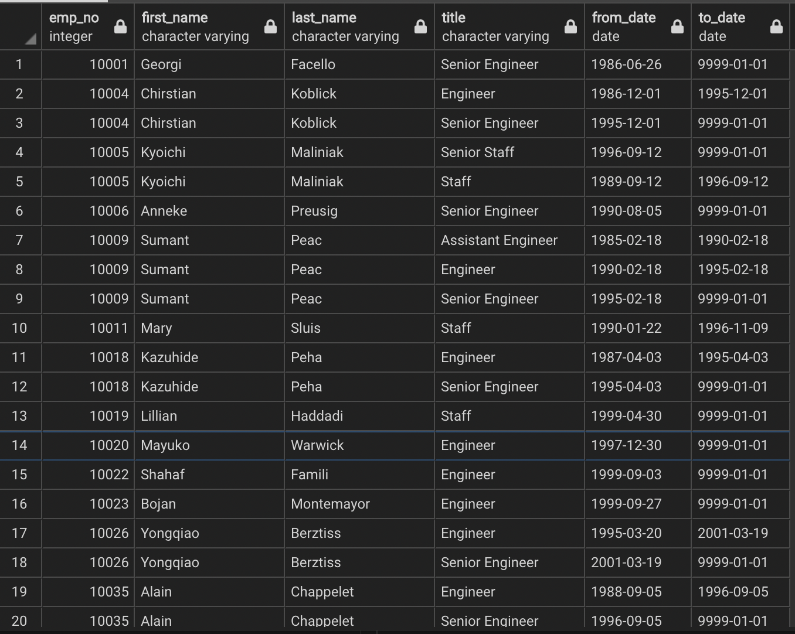
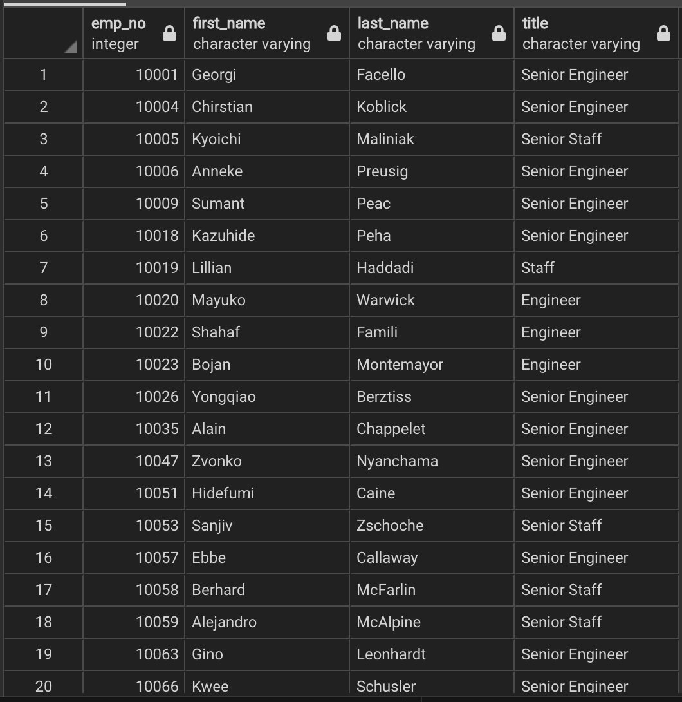
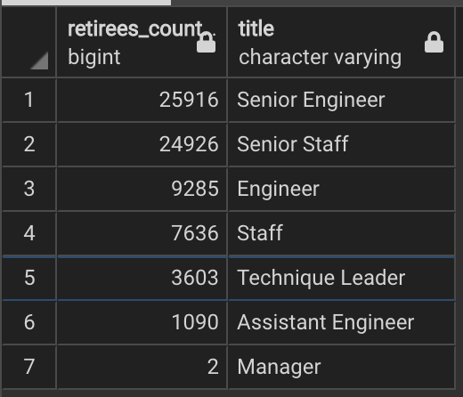
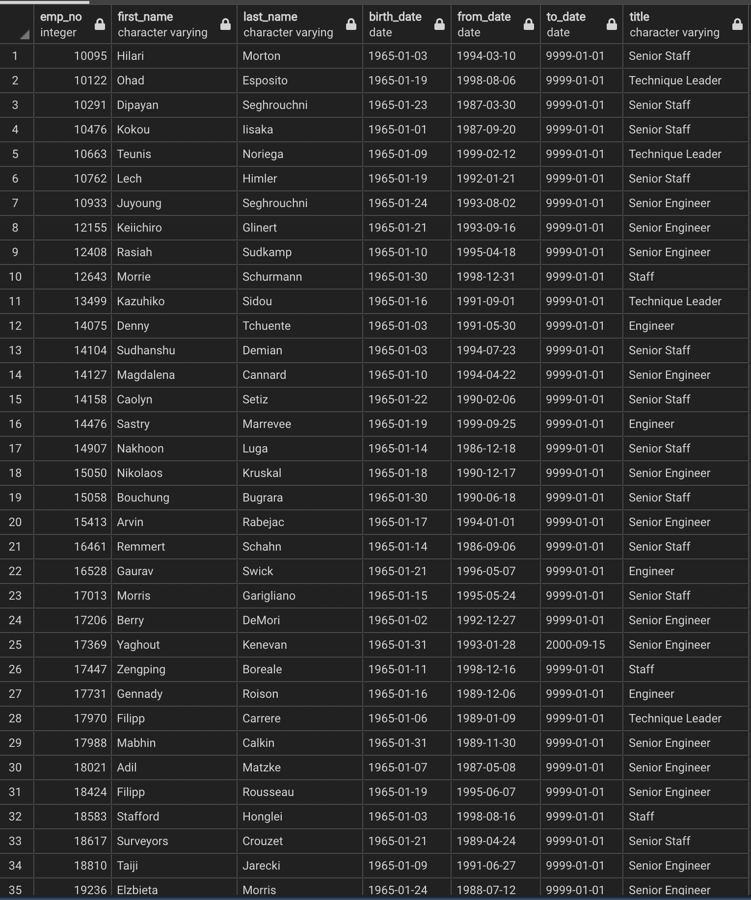

# Pewlett_Hackard_Analysis
## Analysis Overview
### Purpose:
- The purpose of this analysis was to inform the appropriate personnel of Pewlett Hackard of how many current employees would be coming up for retirement, so they can appropriately plan for the future and offer upcoming retirees the opportunity to continue to work part-time under the "Mentorship Program." 

## Results
- As requested I created a table that showed all the employees who are reaching or are at the retirement age based on a birth date range, January 1, 1952-December 31, 1955, which was determined by Bobby's manager. As we can see from the retirement_titles table screenshot we need a more defined table to remove repeat employee entries, which is due to switching job titles at the company, and employees who have already retired from the company.

**Potential Retirees by Title**

- Since the first table of data wasn't refined enough, we created another table that shows only current employees who are reaching retirement age and their curent job title. Now we can see which employees may be retiring soon and which positions will need to be filled. 

**Current Potential Retirees by Current Title**

- The last table gave some helpful information, but in order for the different department managers to properly plan for their deparment's future, we generated a table that shows just how many people per title would be reaching retirement age and sorted it by retirees count from highest to lowest. As we can see the top two positons that are affected are Senior Engineers and Senior Staff members, with large amounts of employees that are reaching retirement age each(approximately twenty five thousand). The next positions on the list, Engineers and Staff members, still have a significant amount of retirement age employees (between 5 and 10 thousand). The positions that have less than five thousand employees reaching retirement age are Technique Leaders, Assistant Engineers, and Managers. This information was asked for because the company wants to create a mentorship program that offers retirement age employees the opportunity to keep working part-time to teach new recruits how to do the work they are retiring from. The departments that manage Engineers and Staff members look like they have the most planning for the future.

**Count of Retirees by Title**

- The last task was to pull the names and titles of the employees who are eligible to participate in the mentorship program and continue working for the company as part-time employees if they desire. 

**Mentorship Eligibility**

## Summary
- By looking at the Count of Retirees by Title table screenshot(above in the Results section), we can see there are over seventy two thousand people with seven different position titles that will need to be filled as the "silver tsunami" begins. Engineers and Staff are the two most impacted by the "silver tsunami."

- As most of the job positions have over one thousand retirement age employees, I believe there are more than enough qualified retirement-ready employees to mentor new hires and next generation Pewlett Hackard employees. 

- Two more tables/queries that might further help the company figure out their future: 
    - A query to generate a table that groups the titles of retirement-ready employees by department.
    - A query to generate a table that groups retirement-ready employees by their title so each individual department knows which employees to reach out to regarding the mentorship program. Salary could also be included on this table so the managers of the department can determine how much money to offer the retirees in their new role as Mentor. 
